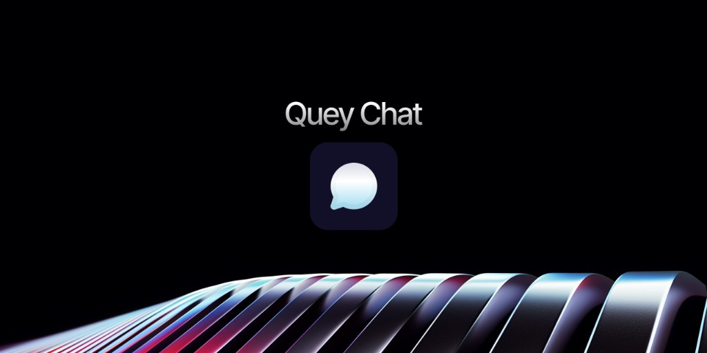

<p align="center">
  
</p>

# Quay Chat

Open-source site chat widget. Visitors message from your site; you answer in Slack, Telegram, a webhook, or your own backend.

Quay is the UI. You bring the backend. Point `endpoint` at something that speaks the [Quay HTTP protocol](./docs/protocol.md), or start from the [example adapters](./examples/adapters/).

> Desktop-only for now (large screens with fine pointers). Mobile support comes later.

## Install

```bash
npm i @aligfx/quay
```

```ts
import { createQuay } from "@aligfx/quay";
import "@aligfx/quay/style.css";

createQuay({
  endpoint: "https://chat.example.com",
  title: "Support",
  avatar: "/avatar.png",
  position: "right",
  theme: {
    panel: "#141416",
    well: "#1a1a1d",
    fg: "#ececee",
    muted: "#8b8b93",
  },
});
```

### Script tag (CDN)

```html
<link rel="stylesheet" href="https://cdn.jsdelivr.net/npm/@aligfx/quay/dist/quay.css" />
<script src="https://cdn.jsdelivr.net/npm/@aligfx/quay/dist/quay.iife.js"></script>
<script>
  Quay.init({
    endpoint: "https://chat.example.com",
    title: "Support",
  });
</script>
```

## Quick demo

**Live:** [aligfx.github.io/quay](https://aligfx.github.io/quay/)

Local:

```bash
git clone https://github.com/aligfx/quay.git
cd quay
npm install
npm run build
npm run demo
```

Open the URL printed in the terminal. Pushing to `main` rebuilds the hosted demo via GitHub Pages.

## Configuration

| Option | Type | Default | Description |
| --- | --- | --- | --- |
| `endpoint` | `string` | — | **Required.** Backend base URL |
| `title` | `string` | `"Chat"` | Panel title |
| `avatar` | `string` | — | Avatar image URL |
| `hostLabel` | `string` | `title` / `"Host"` | Label on host messages |
| `emptyText` | `string` | — | Empty-state copy |
| `placeholder` | `string` | — | Composer placeholder |
| `subtitle` | `string` | — | Optional line on the name gate |
| `position` | `"left" \| "right"` | `"right"` | Dock side |
| `storageKey` | `string` | `"quay_chat_v1"` | localStorage key |
| `theme` | `object` | — | CSS token overrides (`fg` → `--quay-fg`) |
| `desktopOnly` | `boolean` | `true` | Skip mount on non-desktop |

Full reference: [docs/configuration.md](./docs/configuration.md)

## Bring your own channel

1. Deploy something that implements [docs/protocol.md](./docs/protocol.md)
2. Or adapt an example:
   - [Generic webhook](./examples/adapters/generic-webhook.md)
   - [Slack Incoming Webhook](./examples/adapters/slack.md)
   - [Telegram Bot](./examples/adapters/telegram.md)

## Docs

- [Configuration](./docs/configuration.md)
- [HTTP protocol](./docs/protocol.md)
- [Theming](./docs/theming.md)
- [Adapters](./docs/adapters.md)

## License

[MIT](./LICENSE)
